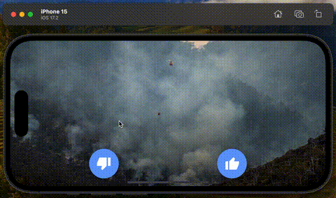

# Welcome to the mobile app of the Pyronear Hackathon

## Get started

1. Install dependencies

   ```bash
   npm install
   ```

   or if you use yarn

   ```
   yarn install
   ```

2. Start the app

   ```bash
    npx expo start
   ```

   or if you use yarn

   ```
   yarn start
   ```

3. You can then open it on your mobile phone in the [Expo Go](https://expo.dev/go) application.

You can start developing by editing the files inside the **app** directory. This project uses [file-based routing](https://docs.expo.dev/router/introduction).

## The goal

Implement a Tinder-like app for swiping on images of forest fires. Users should swipe on the left if the image doesn't contain any fire and to the right if it does.

To help you, you can install this React Native library that abstract the complexity of creating an animated stack of cards: https://github.com/antoine-cottineau/react-native-swipeable-card-stack

You can also try to implement the stack of cards yourself if you prefer.

Here is an example of what you could achieve:


